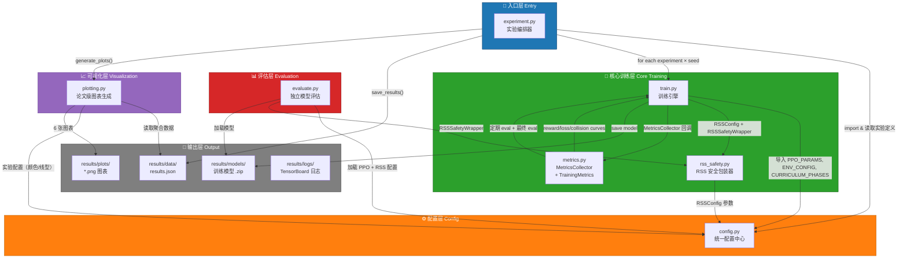
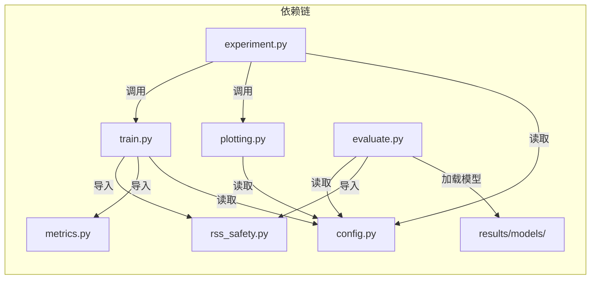
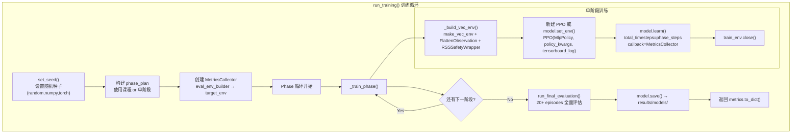
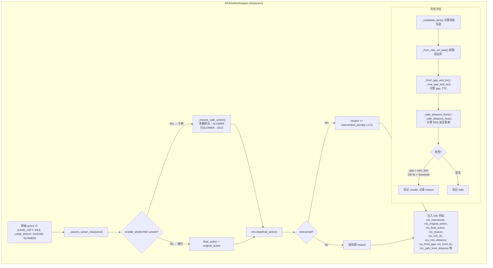
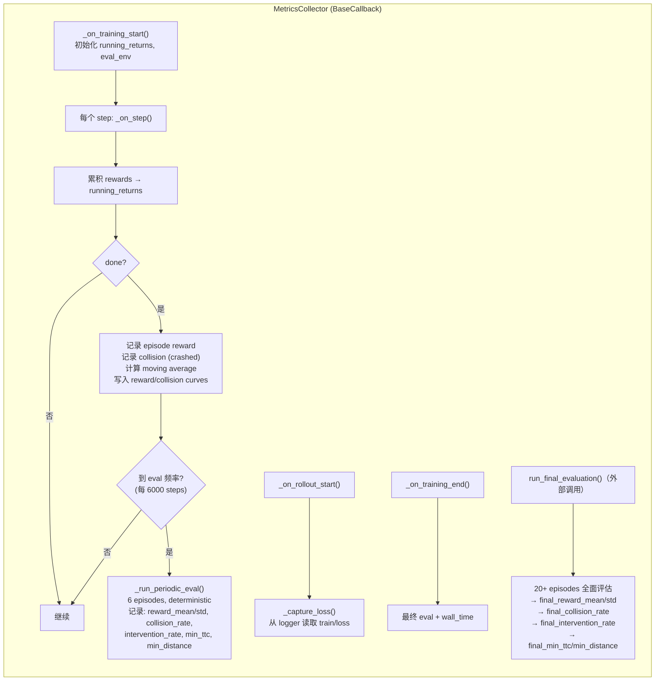
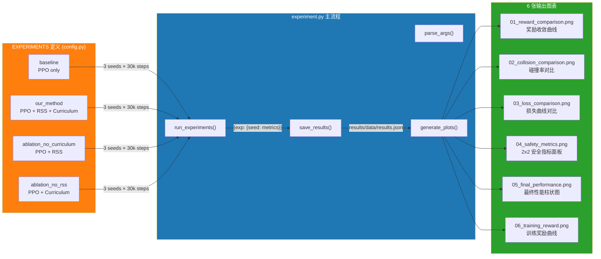

# PPO + RSS 双层次安全框架 — 文件结构与数据流图

---

## 模块依赖关系图

---

## train.py 训练循环详解

---

## RSS 安全包装器 — 动作级安全盾

---

## MetricsCollector 回调 — 数据采集

---

## 实验定义 → 输出全流程

---

## 文件总览

| 文件 | 职责 | 行数 |
|------|------|------|
| `config.py` | 统一配置中心：env、PPO参数、RSS参数、实验定义、种子 | 129 |
| `train.py` | 训练引擎：run_training()，课程学习 + RSS 包装 | 217 |
| `rss_safety.py` | RSS 安全包装器：动作级安全盾，TTC/安全距离计算 | 217 |
| `metrics.py` | MetricsCollector 回调 + TrainingMetrics 数据类 | 277 |
| `plotting.py` | 论文级 matplotlib 图表：6 张对比图 | 377 |
| `experiment.py` | 实验编排器：遍历实验×种子，保存结果，生成图表 | 183 |
| `evaluate.py` | 独立模型评估：加载模型 + 可选 RSS 进行评估 | 120 |

---

## 使用说明

将此 Mermaid 代码复制到支持 Mermaid 渲染的工具中即可查看流程图：

- **GitHub**: 直接粘贴到 `.md` 文件中，GitHub 原生支持 Mermaid 渲染
- **VS Code**: 安装 "Markdown Preview Mermaid Support" 插件
- **在线工具**: https://mermaid.live/
